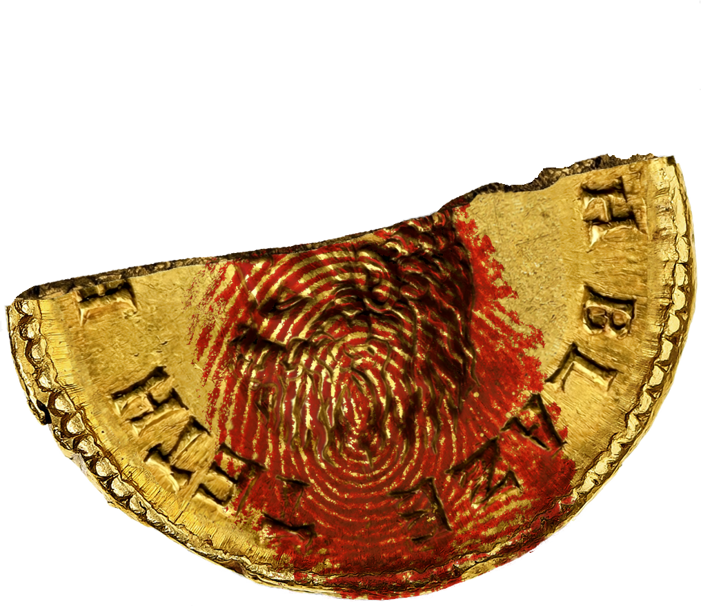

# 3D Imprint

Lay a flat decal — a bloody fingerprint, a stamp, a stain — onto a relief
surface (an engraved coin, embossed leather, a carved seal) so it looks
*pressed into* the surface rather than pasted on top.

There is no 3D model and no normal map. The surface's own **shading** is used
as a proxy for its relief: the program reads the base in black-and-white,
works out where the grooves, ridges, slopes and cliffs are, and uses that to
decide where the decal survives, where it is cut, and how dark it gets.



## The idea

At every pixel, over a small window, two things are measured from the
grayscale base:

| measure | what it is | what it means |
| --- | --- | --- |
| **gradient magnitude** | first derivative (steepness) | how steep the surface is here |
| **peak curvature** | the most-positive Hessian eigenvalue | how strongly it dips into a groove |

Curvature is taken along the *steepest direction only* (the Hessian's peak
eigenvalue, not the Laplacian), so a thin dark **line** between two bright
shoulders scores as strongly as a round pit — a valley is a valley even though
the surface barely changes *along* it. That single distinction sorts the
surface into:

- **valley / groove** — dark line, bright on both sides → high curvature.
  The relief dips here; a draped decal can't reach the bottom, so it is **cut**
  (or, optionally, the stain **pools** — darker and thicker).
- **ridge** — bright line between dark sides → high *negative* curvature. Kept.
- **slope** — bright one side, shallow the other → high gradient, low
  curvature. A continuous shaded face: the decal is **kept, just darker**.
- **cliff** — gradient past a threshold → too steep; the decal is **cut off**
  at the edge.
- **flat** (lit or in shadow) → low gradient and curvature. Kept.

The decal is then relit by the base's local brightness (darker in shadow),
nudged slightly along the shading gradient at edges, and composited as a
translucent film.

Switch the GUI's **View** to *Valley*, *Slope* or *Keep* to see each of these
maps directly — the fastest way to understand and tune the effect.

## Layout

```
print_core.py    the algorithm (analyze_base + compose). Single source of truth.
print_gui.py     interactive Tkinter tuner — load images, drag/scale, live sliders.
place_print.py   batch front-end — set paths + params at the top, run, get a PNG.
examples/        a sample base (coin.png) and decal (fingerprint.png).
output/          renders land here (git-ignored, created on first run).
```

## Requirements

- Python 3.9+
- `numpy`, `scipy`, `Pillow` (see `requirements.txt`)
- **Tkinter** for the GUI. It ships with most Python builds; on Debian/Ubuntu
  install the system package: `sudo apt install python3-tk`.
  Pillow provides `ImageTk` for fast preview; if it's missing the GUI falls
  back to Tk's native PNG loader automatically.

## Install

```bash
python3 -m venv .venv
source .venv/bin/activate          # Windows: .venv\Scripts\activate
pip install -r requirements.txt
```

## Usage

### Interactive (recommended)

```bash
python print_gui.py
```

- **Load base** / **Load top** — pick the surface and the decal (preloaded with
  the examples).
- **Drag** the decal on the canvas to move it; **mouse-wheel** to scale it.
- **Sliders** for every parameter; type an exact value into the box on the
  right and press **Enter** (it clamps to range). **Esc** cancels an edit.
- **View** — *Result · Valley · Slope · Keep · Base* to inspect the detector.
- **Save…** renders at full resolution (the preview runs downscaled for speed)
  and writes a sidecar `*.params.json` so any look is reproducible.

### Batch

Edit the `PARAMS` block at the top of `place_print.py` (paths and knobs), then:

```bash
python place_print.py
```

It writes `output/imprint.png` plus `output/diag_*.png` diagnostic maps.

## Parameters

| param | effect |
| --- | --- |
| `PLACE_SCALE` `PLACE_DX/DY` `PLACE_ROT` | decal size (fraction of base width), position, rotation |
| `PRINT_OPACITY` | overall decal opacity |
| `RELIGHT_AMT` `RELIGHT_LO/HI` | how strongly the decal inherits the base's shading; shadow/highlight clamps |
| `STRUCT_SIGMA` | window scale for the derivatives — roughly half the width of the grooves to catch |
| `STRUCT_PCT` | percentile used to normalise the structure maps to ~[0,1] |
| `VALLEY_CUT_LO/HI` | valley strength range over which the decal fades from kept to fully cut |
| `VALLEY_POOL` | >0 darkens & thickens the stain in grooves instead of cutting (raise the cut range to disable cutting first) |
| `SLOPE_KEEP` `SLOPE_CUT` | gradient below `KEEP` is a gentle face (kept); above `CUT` is a cliff (cut) |
| `SLOPE_SHADE` | extra darkening of the decal on steep (kept) slopes |
| `CUT_FEATHER` | blur on the cut lines so they aren't jagged |
| `DISP_PX` `DISP_BLUR` | small displacement of the decal along the shading gradient at edges |

## Tips

- Grooves too finely cut / decal looks shredded → raise `STRUCT_SIGMA`, or raise
  `VALLEY_CUT_LO/HI` so only the strongest grooves cut.
- Decal floating on top → increase `RELIGHT_AMT` and `SLOPE_SHADE`.
- Works best on satin/diffuse surfaces with roughly uniform colour, where
  brightness really does track relief (it won't read painted-on detail as 3D).
